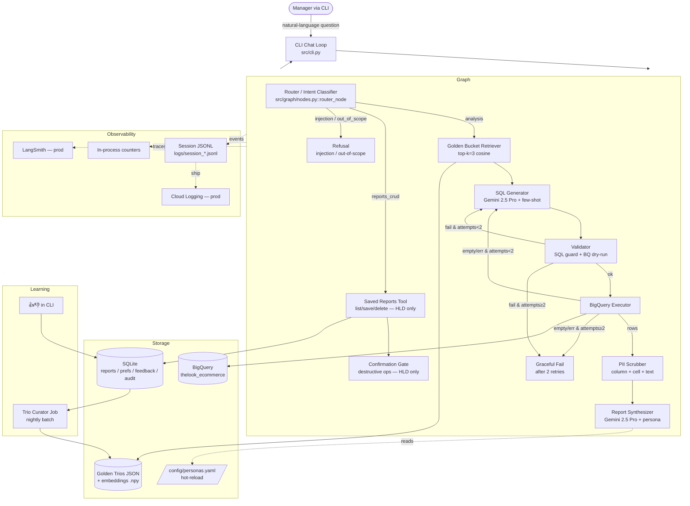

# Architecture — Retail Data Analysis Chat Assistant

## 1. System Overview

A LangGraph state-machine agent gives non-technical retail managers natural-language access to the BigQuery `thelook_ecommerce` dataset. The agent combines SQL generation with retrieval from a "Golden Bucket" of past analyst Trios (Question → SQL → Analyst Report), enforces PII masking at egress, gates destructive operations on a Saved Reports library, learns from interactions, self-heals SQL errors, exposes per-turn observability, and supports hot-reloadable personas so non-developers can change report tone without redeployment.

This document is the High-Level Design. The CLI prototype exercises **all eight requirements** in code (PII Masking, Resilience, QA, Hybrid-Intelligence read+write, High-Stakes Oversight, Continuous Improvement, Observability, Persona Management). Where a capability has obvious production successors (e.g. SQLite → Cloud SQL, file-watched YAML → Firestore + admin form), those are noted under each section as the migration path.

## 2. Architecture Diagram



## 3. Per-requirement design

### 3.1 Hybrid Intelligence — Golden Bucket

**Storage**
- Trios are stored as a JSON file (`data/golden_trios.json`) in the prototype. In production this becomes a GCS bucket (`gs://retail-agent-golden/trios/`) plus an index in **Vertex AI Vector Search** (or pgvector on Cloud SQL).
- Schema per Trio: `{ id, question, sql, report, tags, embedding, author, created_at, quality_score }`.

**Retrieval at query time**
- Embed the user question with `text-embedding-004` (Google).
- Cosine search over the cached embeddings; **k = 3**.
- The retrieved Trios are injected as **few-shot examples** into the SQL generator prompt and as **style anchors** into the Report synthesizer prompt.

**Update path (write to bucket)**
- Every interaction emits a record to a `pending_trios` SQLite table: `(trace_id, user_id, question, sql, report, ts, feedback)`.
- A **nightly Curator job** (a separate small LangGraph) runs and:
  1. Filters to records with 👍 feedback or no negative feedback after 24h.
  2. **Deduplicates** — for each candidate, checks cosine similarity against existing Trios; rejects if `≥ 0.92`.
  3. **Quality-scores** with an LLM-as-judge against a rubric (`{answers_question, factual_consistency, sql_correctness, report_clarity}` 1–5).
  4. Promotes candidates with avg ≥ 4.0 into the production index. Lower-scored go to a quarantine queue for human review.
- Why nightly batch and not online: prevents poisoning the bucket with one bad accidentally-up-voted answer; lets a human review borderline cases.

### 3.2 Safety & PII Masking *(implemented in prototype)*

**Three layers**, all engaged before the LLM ever sees a second-pass copy of any PII:

1. **Column-level mask** (`src/safety/pii.py::mask_dataframe`). Any column whose name matches `email|phone|first_name|last_name|address|...` is hashed (SHA-256, 8 hex prefix → `cust_<hex>`). Deterministic, so the same person resolves to the same token across columns and rows.
2. **Cell-level mask**. Every string cell in every column is regex-scanned for emails and phone numbers (incl. `+972` Israeli format and US-style). Catches PII embedded in `notes`/string aggregations.
3. **Text-level scrub** (`src/safety/pii.py::scrub_text`). Final pass on the synthesized report text. Any leakage is logged (counter `pii.records_masked` and event `report_pii_leak_caught`) for observability.

**Original-value mapping** is held only inside the executor's process scope and is never serialized to logs, model context, or saved reports.

**Prompt-injection / scope guard** (`src/graph/nodes.py::router_node`):
- Heuristic deny-list for obvious injection patterns ("ignore previous instructions", "reveal system prompt") — refused without ever invoking the LLM, so the malicious string isn't even evaluated.
- Scope check: anything that doesn't look like a retail-data analysis question (or a saved-reports CRUD intent) is refused.

**SQL guard** (`src/safety/sql_guard.py`):
- SELECT/WITH only.
- DDL/DML keyword deny-list.
- Single-statement only (rejects `;` followed by more SQL).
- Dataset whitelist — must reference `bigquery-public-data.thelook_ecommerce`.

In production, the BQ connection should also use a service account with the dataset-viewer role only — application-layer guards are belt-and-braces, not the only line of defense.

### 3.3 High-Stakes Oversight — Destructive Operations *(implemented in prototype)*

**Saved Reports library** lives in SQLite in the prototype (`src/tools/reports_store.py`), Cloud SQL in prod. Schema:
```
saved_reports(id, owner_id, title, body, created_at, updated_at, mentions_clients TEXT[])
audit_log(id, ts, actor_id, action, target_ids, reason)
```

**Destructive command flow** (e.g. *"Delete all reports mentioning Client X"*):

1. The CLI command (`/delete <id>` or `/delete-matching <text>`) resolves matching reports and stages a `pending_action` in CLI state.
2. The user is shown the matched reports and the confirmation rules.
3. The next user input is consumed as the confirmation:
   - **Same-owner deletes** require typing `yes`.
   - **Cross-user (GDPR) deletes** are only allowed for users with the `gdpr_officer` role, and require typing the **exact report count** as the confirmation token. Fat-finger on a high-blast-radius command then becomes a no-op.
4. The actual delete goes through `reports_store.delete_ids()`, which re-checks ownership at the data layer — the CLI is not the only enforcement point.
5. Every deletion writes to `audit_log` with `actor_id`, `action`, `target_ids`, `reason`, and the originating chat `trace_id`.

**Why CLI-side confirmation, not a graph node:** the prototype keeps confirmation in the CLI loop because (a) the destructive ops are CLI commands not natural-language, and (b) it avoids needing the LangGraph checkpointer for what is fundamentally a two-turn human-in-the-loop. In production the same flow ports cleanly to LangGraph's `interrupt` API for natural-language destructive ops; the data-layer ownership re-check stays as the actual security boundary.

**Why not in the LLM prompt:** model-only confirmation can be socially engineered ("yes I confirm, do it"). The state-machine + data-layer combination cannot be.

**UX consideration:** confirmation is inline (`yes` / count) on the next user turn — no separate screen or modal — and the prompt prefix changes to `[user CONFIRM]` so it's visually obvious you're in a confirmation state.

### 3.4 Continuous Improvement — Learning Loop *(implemented in prototype)*

**User-level memory.** SQLite table (`src/tools/prefs_store.py`):
```
user_prefs(user_id, key, value, updated_at)  PRIMARY KEY (user_id, key)
```
Keys whitelisted: `report_format` (table | bullets | prose), `default_time_window`, `preferred_currency`. Updates happen two ways:
- **Explicit:** `/prefs set report_format=table` CLI command.
- **Implicit:** the router detects format hints in the user's question (`as a table`, `in bullets`, `as prose`, etc.) via regex and writes the pref before the SQL pipeline runs. The Reporter prompt is rendered with `prefs_store.render_for_prompt(user_id)` so the model sees the user's preferences alongside the persona instructions.

**System-level learning** has two channels:
- **Trio Curator** (§3.1, `scripts/curate.py`) — adds high-quality 👍-voted Q→SQL→Report exemplars to the few-shot pool.
- **Failure-mode review** (HLD only). Every N=200 interactions, an offline script clusters 👎 feedback by failure type (bad SQL / wrong metric / hallucinated number / format complaint) using categorical labels assigned by an LLM judge. The output is a weekly Markdown digest; recurring patterns either become new persona instructions, new Trios, or schema-summary improvements.

**Hybrid Intelligence write path detail.** A new turn ends with the Reporter writing to `pending_trios(trace_id, user_id, question, sql, report, ts, feedback, promoted)`. CLI `/up` and `/down` set `feedback`. `scripts/curate.py` then:
1. `list_unpromoted_upvoted()` returns the candidate set.
2. Each candidate's question is embedded with `text-embedding-004`.
3. Cosine vs. seed + already-curated. If `≥ 0.92` → drop as duplicate.
4. Surviving candidates are scored by a strict Gemini judge on `{sql_correctness, report_clarity, factual_consistency, generalizability}` 1–5.
5. Average ≥ `--min-score` (default 4.0) → appended to `data/curated_trios.json` and the source row is marked `promoted=1`.
6. The full embeddings cache is rebuilt so the next agent invocation picks up the new exemplars.

### 3.5 Resilience & Graceful Error Handling *(implemented in prototype)*

**SQL self-heal loop** (`src/graph/builder.py`):
- **Validator** node first runs a BigQuery `dry_run_query()` (zero cost, no rows materialized). On failure it captures the BQ error message into state.
- **Self-heal** is implicit: the conditional edge from `validate` → `sql_gen` re-enters the SQL generator with `previous_sql` + `bq_error_message` + `last_failure_kind` injected into the prompt. The generator is told to "fix the issue and produce a corrected query."
- **Empty-result branch:** if the query runs but returns 0 rows, we self-heal once with a hint to loosen the filter (likely too-narrow date window or string match).
- **Retry budget:** `SQL_RETRY_LIMIT = 2` (configurable). Hard cap, enforced by state, so cost is bounded — no runaway retries.
- After exceeding the budget, the `graceful_fail` node returns a structured "I tried N times — last failure was X — try rephrasing" message. The CLI never crashes.

**External-call resilience** (`src/llm/gemini.py`):
- `with_retries` decorator: 3 attempts, exponential backoff (0.5s → 1s → 2s + jitter), retries only on transient signals (`rate limit`, `503`, `timeout`, `unavailable`, `internal error`, etc.). Permission errors and validation errors fail fast.
- **Two-tier model fallback.** `GeminiLLM.invoke` tries Gemini 2.5 Pro first; if it ultimately fails after retries, it falls back to Gemini 2.5 Flash. If both fail, the calling node catches and returns a graceful structured message — the graph still terminates cleanly.

**Process-level resilience.** The CLI's outer loop wraps `graph.invoke` in `try/except`; any unhandled exception is logged with the trace_id and the loop continues. The user sees `"Sorry, I hit an unexpected error. trace_id=<x>"` and can keep going.

**Production additions** (not in prototype):
- **Circuit breaker** at the LLM layer — if 5 failures in 60 s, open the breaker and short-circuit to a "service degraded — retry shortly" response for 30 s. Prevents thundering herd against a sick upstream.
- **Cached-Trio fallback** — if Gemini is fully down and the user's question has cosine similarity ≥ 0.92 to a stored Trio, serve the stored report with a "served from cache, real-time data unavailable" disclaimer.
- **Cost guardrail** — every BQ job goes through `dry_run_query` first; jobs with `bytes_processed > BUDGET_BYTES` are blocked with a polite "this query would scan X GB; please narrow it" response.

### 3.6 Quality Assurance *(implemented in prototype)*

**Three layers**, run in CI before any deploy:

1. **Unit tests** — pure functions: PII masker, SQL guard. Fast, no external deps. (`tests/test_pii.py`, `tests/test_sql_guard.py`).
2. **End-to-end smoke** with monkeypatched BQ + LLM (`tests/test_graph_smoke.py`) — verifies the graph wiring, self-heal path, retry budget, and refusal path.
3. **Golden eval harness** — `eval/golden_questions.jsonl` + `scripts/run_eval.py`. Each entry is `{question, must_mention_substrings, must_not_mention_substrings, min_rows, expect_refusal?, pii_test?}`. The runner runs the agent end-to-end against real BigQuery and asserts:
   - SQL runs without error
   - At least `min_rows` results
   - Report contains required substrings (e.g. "revenue") and avoids forbidden ones (e.g. "@")
   - For `pii_test: true` cases, the rendered report contains zero email patterns even when the user explicitly asked for emails (sanity check on the masker)
   - For `expect_refusal: true` cases, the agent refused without running a query

**LLM-as-judge** is wired in the same script. A separate Gemini call scores each report on `{answers_question, factual_consistency, no_pii_leak, persona_adherence}` 1–5. Pre-deploy gate: structural-pass = 100%, average judge score ≥ 4.0, zero PII failures. The script exits non-zero on a fail so it can be wired into CI directly.

**Production regression loop:** every 👎 in production is triaged. Confirmed regressions become new entries in `golden_questions.jsonl`, which keeps CI pressure honest over time.

### 3.7 Observability

**Per-turn artifacts** (in this prototype, every CLI run produces them):
- `logs/session_<id>.jsonl` — append-only event log per session. Every node emits `node_start` and `node_end` (or `node_error`) with `trace_id`, `latency_ms`, and a truncated payload preview. Other events emitted: `sql_generated`, `validate_static_fail`, `validate_dryrun_fail`, `validate_ok`, `execute_ok`, `execute_fail`, `mask_done`, `report_pii_leak_caught`, `report_done`, `turn_unhandled_error`.
- **In-process counters** (`/counters` CLI command): node ok/error counts, refusals, PII hits, graceful_fail count.

**Metrics tracked** (would be exported to Prometheus / Cloud Monitoring in prod):

| Metric | Why |
|---|---|
| Latency (p50/p95/p99) end-to-end + per-node | Detect node-level regressions. |
| Self-heal trigger rate | Alarm if > 15% — model is losing fidelity or schema drifted. |
| Empty-result rate | Often indicates a router/scope mismatch. |
| Refusal rate (split by reason) | Spike in injection refusals = under attack. |
| PII detection count | Should never be 0 if the relevant column was queried — sanity check the masker. |
| Cost per query (BQ bytes scanned + LLM tokens × price) | Cost guardrail and budgeting. |
| Trio retrieval similarity distribution | Falling similarity → Golden Bucket is going stale. |
| 👍/👎 feedback ratio | Headline product metric. |

**Deep-dive / debugging path.** Each session JSONL is a complete replay. The `scripts/replay.py` admin tool walks the file and prints node-by-node what happened, grouped by `trace_id`, with per-node latency. Filter to a single turn with `--trace-id <prefix>`. Latest session: `python -m scripts.replay --latest`.

**Production stack:**
- **LangSmith** for full LLM traces (free tier is enough for early stages).
- **Cloud Logging** sink for all structured JSON logs, with a Looker Studio dashboard on top of BigQuery log exports for the metrics table.
- **Sentry / Cloud Error Reporting** for unhandled exceptions.
- **PagerDuty** alert rules: `self_heal_rate > 0.2 for 10m`, `refusal.injection rate > 0.05 for 5m`, `latency p95 > 30 s`.

### 3.8 Persona Management

**File** `config/personas.yaml`:
```yaml
active: concise_executive
personas:
  concise_executive:
    description: "Direct, BLUF style."
    instructions: |
      Lead with the headline number...
  storyteller:
    description: "Narrative analyst."
    instructions: |
      ...
```

**Hot reload.** `src/tools/persona.py::load_active_persona` is called at the start of every report synthesis, so the YAML is re-read on every turn. No restart, no redeployment. **Fail-safe:** if the file is malformed or the active key points to a non-existent persona, the loader logs an error and serves the **last-known-good** persona — a typo by an editor never takes the agent down.

**Non-developer editing.** In production, the YAML file backing this is hosted in **Firestore** (or GCS with object versioning). A simple admin web form writes to it; the agent process subscribes via Pub/Sub for invalidation. CEO can change tone weekly without a deploy.

**Validation.** Schema-validated on load (required fields, max instruction length). A simple smoke prompt is dry-rendered before promotion in the admin form, catching obvious template bugs before the change hits real users.

## 4. Data flow on a typical turn

1. User types a question in the CLI.
2. `cli.py` creates a `trace_id`, opens the session JSONL, builds the initial state.
3. **Router** classifies intent. Refuses early on injection / out-of-scope.
4. **Retriever** embeds the question and pulls top-3 Trios from the cached embedding matrix (numpy cosine).
5. **SQL Generator** receives `{schema_summary, retrieved_trios, user_question, prior_failure?}` and produces a SQL string.
6. **Validator** runs `sql_guard.validate_sql` (static checks) then BigQuery `dry_run_query` (zero-cost syntax/permissions check).
   - On failure within retry budget → loop back to SQL Generator with the error context.
7. **Executor** runs the query for real.
   - On runtime error or empty result within retry budget → loop back to SQL Generator.
8. **Mask** node runs column-level then cell-level PII masking on the raw DataFrame.
9. **Reporter** loads the active persona, builds the prompt with masked rows + persona instructions + question + SQL, calls Gemini, then runs a final text-level PII scrub on the output.
10. CLI prints the final message; session JSONL is flushed.

## 5. Cloud / model rationale

| Choice | Why |
|---|---|
| **Gemini 2.5 Pro** for SQL gen + report synthesis | Strongest BigQuery-dialect SQL generation among the free-tier-accessible models; long context fits schema + multi-Trio few-shot easily. |
| **Gemini 2.5 Flash** as fallback + router | Fast, cheap, generous free tier; degrading to Flash is a real-world useful capacity guard. |
| **`text-embedding-004`** | Same provider, no extra credentials, 768-dim is plenty for ~12–10k Trios. |
| **BigQuery** | Required by the assignment. The free tier (1 TB/mo) plus dataset partitioning makes the demo essentially free. |
| **ChromaDB / pgvector / Vertex AI Vector Search** *(prod path)* | We use a numpy-backed JSON cache in this prototype; the upgrade path is determined by team operational preference (managed vs self-hosted). |
| **SQLite / Cloud SQL** | Zero-ops in prototype, drop-in to Postgres in prod. |
| **LangGraph** | Required; explicit state machine fits the conditional retries + confirmation gates better than a free-form ReAct loop. |

## 6. Why we kept the dependency surface small

The pinned `requirements.txt` was given to us. We added only **PyYAML** (for `personas.yaml`) and **pytest** (for tests). Specifically we did *not* add Chroma, Presidio, sqlglot, structlog, tenacity, watchdog, or LangSmith — each of those would be a reasonable production choice but is replaceable here by ~30 lines of stdlib code, which keeps the prototype trivial to set up on a reviewer's machine.

## 7. Production migration checklist

- [ ] Move BQ creds from ADC to a workload-identity-bound service account with `roles/bigquery.dataViewer` on the dataset only.
- [ ] Move Golden Bucket to GCS + Vertex AI Vector Search; replace `numpy` cosine with the managed index.
- [ ] Move SQLite to Cloud SQL (Postgres). Add the `pending_trios`, `audit_log`, `user_prefs`, `saved_reports` tables.
- [ ] Replace YAML-on-disk with Firestore-backed personas + a small admin web form.
- [ ] Wire LangSmith + Cloud Logging + Sentry; set up the alert rules in §3.7.
- [ ] Stand up the nightly Curator job in Cloud Run + Cloud Scheduler.
- [ ] Add the `eval/` harness to CI as a deploy gate.
- [ ] Add a circuit breaker around Gemini and a BQ-bytes budget guard.
- [ ] Replace the CLI with a thin web UI (out-of-scope per assignment, but the LangGraph back-end is unchanged).
